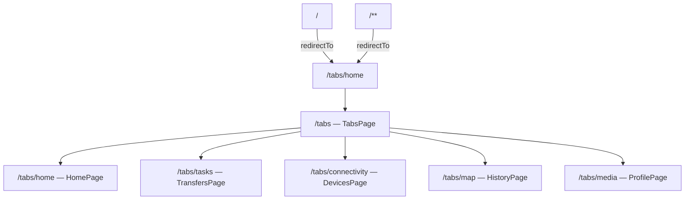
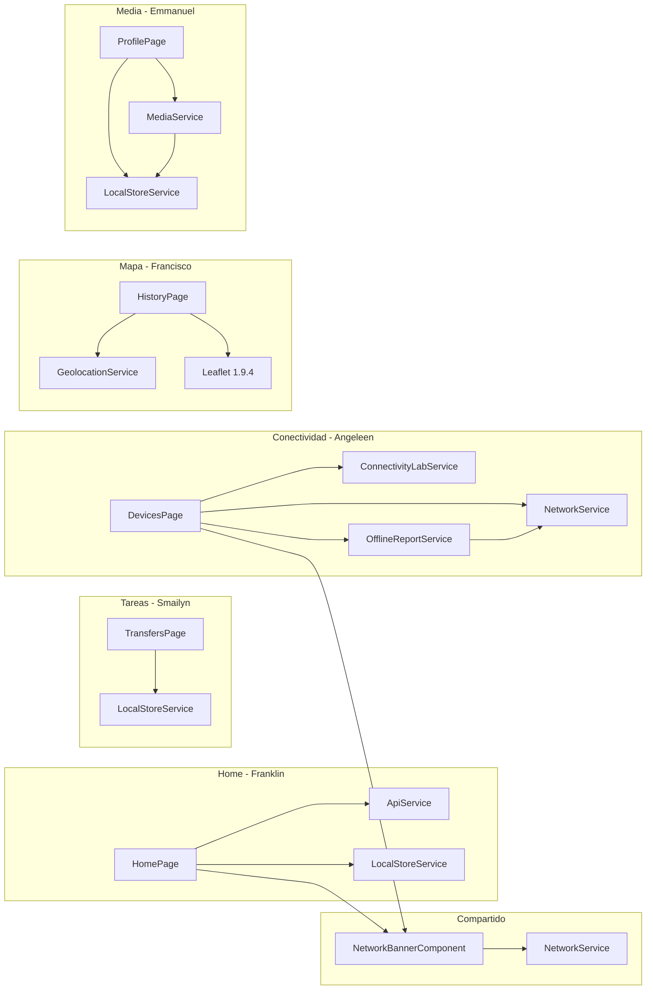
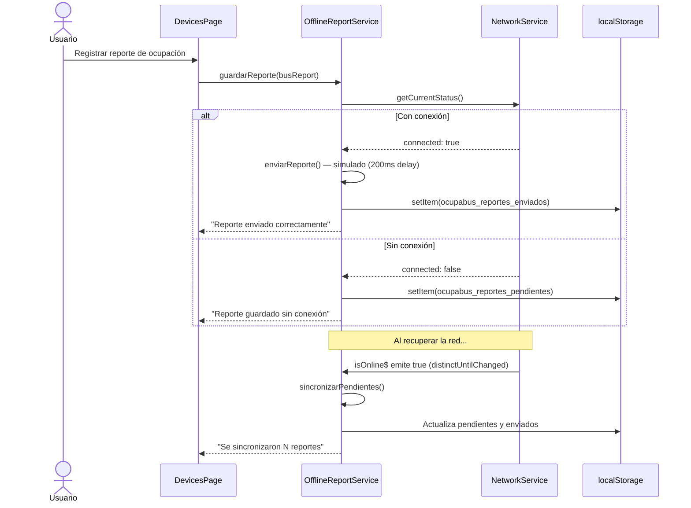

# Arquitectura técnica — OcupaBus AP4

---

## 1. Descripción general

OcupaBus tiene una **organización lógica por responsabilidades funcionales**, coherente con las convenciones de Ionic/Angular para aplicaciones de complejidad media. No existen capas formales de dominio, repositorios de datos ni casos de uso separados.

| Nivel lógico | Elementos | Responsabilidad |
|---|---|---|
| Presentación | Páginas (`*.page.ts`, `*.page.html`), `NetworkBannerComponent` | Coordinan eventos de usuario y presentación. Sin lógica de persistencia. |
| Lógica y estado | 7 servicios singleton (`*.service.ts`) | Estado reactivo (`BehaviorSubject`), lógica de negocio y acceso a datos en la misma clase. |
| Datos | `localStorage`, APIs externas | Sin abstracción de repositorio; los servicios acceden directamente. |

---

## 2. Bootstrapping

La aplicación no usa `NgModule`. Se inicializa con `bootstrapApplication()` (patrón standalone de Angular 14+):

```typescript
// src/main.ts
bootstrapApplication(AppComponent, {
  providers: [
    { provide: RouteReuseStrategy, useClass: IonicRouteStrategy },
    provideIonicAngular(),
    provideRouter(routes, withPreloading(PreloadAllModules)),
  ],
});
```

`IonicRouteStrategy` gestiona el historial de navegación con comportamiento nativo de Ionic. `PreloadAllModules` descarga en segundo plano los chunks de los módulos no activos tras el primer render.

---

## 3. Componentes standalone

Todas las páginas usan `standalone: true`. Cada una declara sus propias importaciones en el array `imports[]`, sin depender de NgModule compartidos. Esto permite la carga diferida por ruta.

---

## 4. Enrutamiento y navegación

Definido en `src/app/app.routes.ts`. Todas las rutas usan `loadComponent()` (lazy loading).

| Ruta | Componente | Etiqueta en barra inferior |
|------|------------|--------------------------|
| `/tabs/home` | `HomePage` | Inicio |
| `/tabs/tasks` | `TransfersPage` | Tareas |
| `/tabs/connectivity` | `DevicesPage` | Conectividad |
| `/tabs/map` | `HistoryPage` | Mapa |
| `/tabs/media` | `ProfilePage` | Media |
| `/` y `/**` | — | Redirige a `/tabs/home` |



---

## 5. Módulos funcionales y dependencias



---

## 6. Servicios y estado reactivo

Los 7 servicios son singletons (`providedIn: 'root'`). Todos usan el patrón `BehaviorSubject<T>`:

- El servicio mantiene un `BehaviorSubject` privado como fuente de verdad.
- Expone su observable con `.asObservable()` para prevenir emisiones externas.
- Las páginas consumen el observable con `async` pipe, sin gestionar suscripciones manualmente.

```
Evento usuario → método del servicio → BehaviorSubject.next(nuevoValor)
                                      → localStorage.setItem(...)
                                      → async pipe detecta cambio → re-render
```

| Servicio | Estado que gestiona | Persistencia |
|---|---|---|
| `ApiService` | Noticias, estado, borrador de feedback | No |
| `LocalStoreService` | Tareas, capturas, configuración | `localStorage` |
| `GeolocationService` | Posición GPS, puntos de campus, estado | No |
| `MediaService` | Pistas de audio, reproducción, capturas | Delega a `LocalStoreService` |
| `ConnectivityLabService` | Dispositivos BT/NFC, logs, estado | No |
| `NetworkService` | Estado de conexión (online/offline, tipo) | No |
| `OfflineReportService` | Cola de reportes pendientes y enviados | `localStorage` |

---

## 7. Arquitectura Offline First



> `enviarReporte()` es una simulación académica (delay 200 ms + `console.log`). No realiza ninguna petición HTTP real.

---

## 8. Persistencia

El único mecanismo de persistencia es `localStorage`. `LocalStoreService` centraliza la lectura y escritura mediante dos métodos privados: `read<T>(key, fallback)` y `write(key, value)`.

| Clave | Tipo | Fallback |
|-------|------|---------|
| `ocupabus_tasks` | `AppTask[]` | 2 tareas de ejemplo (`seedTasks()`) |
| `ocupabus_captures` | `CaptureItem[]` | Array vacío |
| `ocupabus_settings` | `ProfileSettings` | Perfil por defecto de Franklin |
| `ocupabus_reportes_pendientes` | `BusReport[]` | Array vacío |
| `ocupabus_reportes_enviados` | `BusReport[]` | Array vacío |

**Limitaciones de esta aproximación:** sin cifrado, sin versionado de esquema, sin transacciones, límite de ~5–10 MB, operaciones síncronas que bloquean el hilo principal en escrituras grandes.

---

## 9. Integración con APIs externas

### JSONPlaceholder

`ApiService` usa `fetch()` nativo (no `HttpClient` de Angular):

- `GET https://jsonplaceholder.typicode.com/posts?_limit=5` → transforma en `NewsItem[]`
- `POST https://jsonplaceholder.typicode.com/posts` → simula envío de feedback (JSONPlaceholder responde con un ID ficticio, no almacena nada)

En error de red: fallback a 3 noticias semilla (`seedNews()`).

### OpenStreetMap

`HistoryPage` usa Leaflet para renderizar tiles de `https://{s}.tile.openstreetmap.org/{z}/{x}/{y}.png`. El mapa se inicializa en `ngAfterViewInit()` con `setTimeout(() => map.invalidateSize(), 300)` para corregir el tamaño tras la animación de transición de Ionic.

---

## 10. Integración con Capacitor

Solo `@capacitor/network` tiene uso comprobado en el código de la aplicación:

```typescript
// network.service.ts
Network.getStatus()                          // estado inicial
Network.addListener('networkStatusChange')   // listener de cambios
```

Esto requiere el permiso `ACCESS_NETWORK_STATE` declarado en `AndroidManifest.xml`.

Las demás funcionalidades nativas se acceden mediante APIs web estándar del navegador (ejecutadas por el WebView de Capacitor en Android):

| Función | API web | Plugin de Capacitor |
|---------|---------|---------------------|
| GPS | `navigator.geolocation` | Ninguno |
| Bluetooth | `navigator.bluetooth` | Ninguno |
| Cámara / galería | `<input type="file">` | Ninguno |
| Audio | `AudioContext` | Ninguno |

---

## 11. Arquitectura general — diagrama completo

```mermaid
graph TD
    U[Usuario] --> UI[Ionic 8 / Angular 20]

    subgraph Presentación
        UI --> AC[AppComponent]
        AC --> TABS[TabsPage]
        TABS --> HOME[HomePage]
        TABS --> TRANS[TransfersPage]
        TABS --> DEV[DevicesPage]
        TABS --> HIST[HistoryPage]
        TABS --> PROF[ProfilePage]
        BANNER[NetworkBannerComponent]
        HOME --> BANNER
        DEV --> BANNER
    end

    subgraph Servicios singleton
        API[ApiService]
        LS[LocalStoreService]
        GEO[GeolocationService]
        MEDIA[MediaService]
        CONN[ConnectivityLabService]
        NET[NetworkService]
        ORS[OfflineReportService]
    end

    HOME --> API
    HOME --> LS
    TRANS --> LS
    DEV --> CONN
    DEV --> ORS
    DEV --> NET
    HIST --> GEO
    PROF --> MEDIA
    PROF --> LS
    MEDIA --> LS
    ORS --> NET
    BANNER --> NET

    subgraph Persistencia
        LSKEY[(localStorage)]
    end

    LS --> LSKEY
    ORS --> LSKEY

    subgraph APIs externas
        JSON[JSONPlaceholder]
        OSM[OpenStreetMap Tiles]
    end

    API -->|fetch GET/POST| JSON
    HIST -->|L.tileLayer| OSM

    subgraph APIs del navegador
        GPSNAV[navigator.geolocation]
        BLENAV[navigator.bluetooth]
        AUDWEB[Web Audio API]
        FILER[FileReader API]
        CAPNET[@capacitor/network]
    end

    GEO --> GPSNAV
    CONN --> BLENAV
    MEDIA --> AUDWEB
    MEDIA --> FILER
    NET --> CAPNET
```

---

## 12. Limitaciones de escalabilidad

- Los servicios mezclan gestión de estado, acceso a datos y lógica de negocio en la misma clase. Escalar requeriría separar estas responsabilidades.
- `localStorage` no soporta volúmenes de datos crecientes ni acceso concurrente.
- No existe manejo global de errores (`ErrorHandler`). Los errores se absorben en cada servicio y se comunican vía `status$`.
- La ausencia de un backend real limita el sistema a un prototipo funcional.
