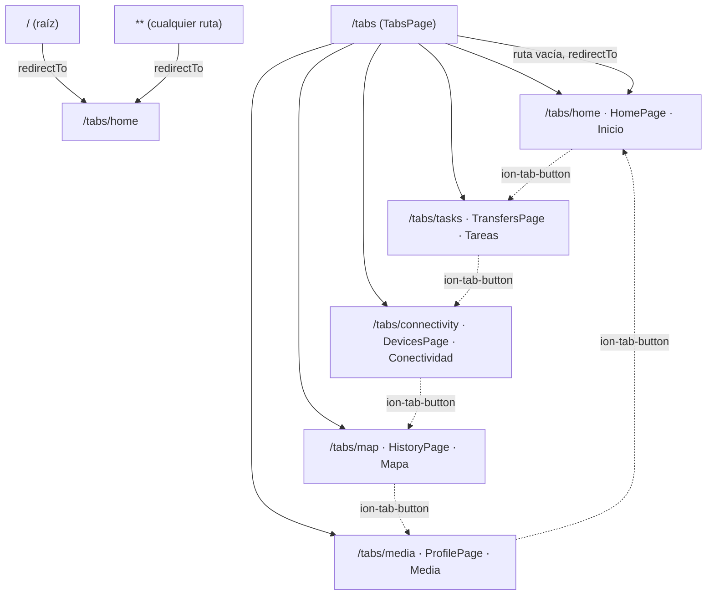

<div align="center">

# Universidad Abierta para Adultos (UAPA)

### Escuela de Ingeniería y Tecnología

### Programación de Dispositivos Móviles — ISW-307

---

# GUÍA DE ESTILO E IDENTIDAD VISUAL

## Proyecto: OcupaBus

### Equipo: Grupo Z

**Periodo:** Julio 2026

</div>

<div style="page-break-after: always;"></div>

## Tabla de Contenido

1. [Introducción](#1-introducción)
2. [Identidad Visual](#2-identidad-visual)
3. [Paleta de Colores](#3-paleta-de-colores)
4. [Tipografía](#4-tipografía)
5. [Iconografía](#5-iconografía)
6. [Componentes Visuales](#6-componentes-visuales)
7. [Sistema de Navegación](#7-sistema-de-navegación)
8. [Organización Visual](#8-organización-visual)
9. [Estilo de Pantallas](#9-estilo-de-pantallas)
10. [Experiencia de Usuario (UX)](#10-experiencia-de-usuario-ux)
11. [Responsive Design](#11-responsive-design)
12. [Accesibilidad](#12-accesibilidad)
13. [Principios de Diseño](#13-principios-de-diseño)
14. [Consistencia Visual](#14-consistencia-visual)
15. [Capturas Sugeridas](#15-capturas-sugeridas)
16. [Conclusiones](#16-conclusiones)
17. [Resumen del Análisis](#17-resumen-del-análisis)

<div style="page-break-after: always;"></div>

## 1. Introducción

### Propósito del documento

Esta guía documenta la identidad visual y el sistema de estilo **realmente implementados** en el código fuente del proyecto OcupaBus, una aplicación híbrida construida con **Ionic 8**, **Angular 20** y **Capacitor 8**. Todo el contenido fue extraído mediante inspección directa de los archivos del repositorio: hojas de estilo (`.scss`), plantillas (`.html`), componentes (`.ts`), configuración de Capacitor/Angular y recursos de `assets/`. No se incluye ningún color, fuente, componente o recurso que no tenga evidencia verificable en el código.

### Importancia de mantener consistencia visual

OcupaBus está compuesto por cinco módulos funcionales desarrollados por distintos integrantes del equipo (Home, Tareas, Conectividad, Mapa, Media). El análisis confirma que los cinco módulos comparten un mismo patrón estructural (`page-shell`, `.hero`, `ion-card`) y una paleta de colores reducida y repetida, lo que indica un esfuerzo deliberado de coherencia visual entre desarrolladores distintos. Esta guía formaliza ese patrón implícito para que futuras modificaciones lo mantengan.

### Relación con el Documento Técnico

Este documento complementa la documentación técnica del proyecto (`docs/documentacion_tecnica_AP4.md` y `docs/ARCHITECTURE.md`), la cual describe la arquitectura funcional y los módulos. La presente guía se enfoca exclusivamente en la **capa visual y de experiencia de usuario**, sin repetir el detalle arquitectónico ya cubierto en esos documentos.

<div style="page-break-after: always;"></div>

## 2. Identidad Visual

| Elemento                                          | Estado                                                                                                                                                                                                                                                                                                        | Evidencia                                                                                                                                      |
| ------------------------------------------------- | ------------------------------------------------------------------------------------------------------------------------------------------------------------------------------------------------------------------------------------------------------------------------------------------------------------- | ---------------------------------------------------------------------------------------------------------------------------------------------- |
| **Nombre oficial de la aplicación**               | `OcupaBus` (interfaz) / `OcupaBus AP4` (nombre de app nativa)                                                                                                                                                                                                                                                 | `src/index.html` línea 5 (`<title>OcupaBus</title>`); `capacitor.config.ts` línea 5 (`appName: 'OcupaBus AP4'`)                                |
| **Logotipo institucional propio**                 | **No existe.** El único recurso gráfico de marca es el favicon                                                                                                                                                                                                                                                | `src/assets/icon/` contiene únicamente `favicon.png`; no hay carpeta `logo/` ni referencias a un logotipo en HTML/TS                           |
| **Isotipo**                                       | **No existe** un isotipo definido como recurso independiente del favicon                                                                                                                                                                                                                                      | Búsqueda exhaustiva en `src/assets/` — solo dos archivos: `favicon.png` y `shapes.svg`                                                         |
| **Favicon**                                       | Existe: ícono circular azul con motivo geométrico tipo "X", 64×64 px, PNG con paleta indexada de 8 bits                                                                                                                                                                                                       | `src/assets/icon/favicon.png`; referenciado en `src/index.html` línea 10 (`<link rel="icon" type="image/png" href="assets/icon/favicon.png">`) |
| **Splash Screen (web/Angular)**                   | **No configurado.** No existe el plugin `@capacitor/splash-screen` en `package.json` ni configuración de splash en `capacitor.config.ts`                                                                                                                                                                      | Verificado en `package.json` (sin la dependencia) y `capacitor.config.ts` (sin bloque `SplashScreen`)                                          |
| **Splash Screen (Android nativo)**                | Existe únicamente en el proyecto Android generado por Capacitor (`android/app/src/main/res/drawable*/splash.png`), pero corresponde al **splash genérico por defecto de Capacitor** (ícono "X" azul sobre fondo blanco), no a un diseño institucional de OcupaBus                                             | `android/app/src/main/res/drawable/splash.png` y variantes `drawable-land-*`, `drawable-port-*`                                                |
| **Imágenes institucionales (UAPA, equipo, etc.)** | **No existen** en `src/assets/` ni en el resto del repositorio versionado. Las capturas de pantalla de evidencia se excluyen del control de versiones (ver `.gitignore`) y no forman parte del código fuente ni del bundle de la aplicación                                                                   | Listado completo de `src/assets/`: `icon/favicon.png`, `shapes.svg`; `.gitignore` (`/documentacion/*.png`); `docs/ACADEMIC_EVIDENCE.md`        |
| **Asset sin uso (`shapes.svg`)**                  | Existe en `src/assets/shapes.svg` pero **no se referencia en ningún archivo `.html` o `.ts`** del proyecto — es un recurso huérfano                                                                                                                                                                           | `grep -r "shapes.svg" src/` no arroja coincidencias fuera del propio archivo                                                                   |
| **Colores predominantes**                         | Ver sección 3. El degradado `#0f766e` aparece en el `.hero` de las 5 pantallas (siempre combinado con otro color); el verde institucional `#14532d` aparece en 3 de las 5 (`Home`, `Conectividad`, `Tareas`, degradado `#14532d → #0f766e`); `Mapa` usa `#0f766e → #1d4ed8` y `Media` usa `#1d4ed8 → #0f766e` | Ver tabla de la sección 3.2                                                                                                                    |

> **Nota de hallazgo:** El proyecto no define una identidad de marca gráfica formal (sin logotipo, isotipo ni splash screen propios). La identidad visual observable se construye exclusivamente mediante **paleta de color consistente** y **tipografía del sistema**, aplicada de manera repetida en la sección `.hero` de cada pantalla.

<div style="page-break-after: always;"></div>

## 3. Paleta de Colores

### 3.1 Variables de tema Ionic (`src/theme/variables.scss`)

El archivo `src/theme/variables.scss` **no contiene ninguna variable `--ion-color-*` personalizada**. Su contenido íntegro es:

```scss
// For information on how to create your own theme, please refer to:
// https://ionicframework.com/docs/theming/
```

Esto confirma que el proyecto **no sobrescribe la paleta de colores por defecto de Ionic** (`primary`, `secondary`, `tertiary`, `success`, `warning`, `danger`, `medium`, `light`, `dark`). Todo color visible en la aplicación proviene de:

1. Colores nombrados del sistema Ionic (atributo `color="..."` en componentes), con sus valores por defecto de Ionic 8.
2. Colores HEX explícitos escritos directamente en los `.scss` de cada página o en `styles` inline de componentes standalone.

### 3.2 Colores HEX explícitos encontrados en el código

Tabla generada a partir de todos los literales `#RRGGBB` / `#RGB` localizados en `src/app/**/*.scss`, `src/global.scss` y `styles` inline de `network-banner.component.ts` y `media.service.ts`. La columna **Evidencia** indica el archivo donde aparece.

| Color                                        | HEX                    | RGB aprox.         | Uso principal                                                                                                                                                               | Evidencia                                                                                                                             |
| -------------------------------------------- | ---------------------- | ------------------ | --------------------------------------------------------------------------------------------------------------------------------------------------------------------------- | ------------------------------------------------------------------------------------------------------------------------------------- |
| Verde institucional oscuro                   | `#14532d`              | rgb(20, 83, 45)    | Degradado de `.hero` en Home, Conectividad, Tareas; color de texto en `.stats-grid h3`; `--background` de `.send-button`; `--color-selected` de `ion-tab-button`            | `home.page.scss`, `devices.page.scss`, `transfers.page.scss`, `tabs.page.scss`                                                        |
| Verde azulado (teal)                         | `#0f766e`              | rgb(15, 118, 110)  | Segundo color del degradado `.hero` en Home, Conectividad, Tareas; primer color del degradado en Mapa; `--background` de `.focus-button`; estado "online" del banner de red | `home.page.scss`, `devices.page.scss`, `transfers.page.scss`, `history.page.scss`, `network-banner.component.ts`                      |
| Azul institucional                           | `#1d4ed8`              | rgb(29, 78, 216)   | Degradado `.hero` en Media/Perfil y Mapa; `--background` de `.camera-button`; ícono de posición GPS del usuario en Leaflet                                                  | `profile.page.scss`, `history.page.scss`, `history.page.ts`                                                                           |
| Gris azulado (texto secundario)              | `#64748b`              | rgb(100, 116, 139) | Texto secundario (`.card-copy`, `small`, subtítulos de tarjetas) en todas las páginas                                                                                       | `home.page.scss`, `devices.page.scss`, `transfers.page.scss`                                                                          |
| Azul marino (texto oscuro)                   | `#0f172a`              | rgb(15, 23, 42)    | Títulos de items de lista (`ion-label h3`); color base de sombras (`rgba(15,23,42, …)`) en todas las tarjetas                                                               | `home.page.scss`, `profile.page.scss`, `transfers.page.scss`                                                                          |
| Gris pizarra (texto de párrafo)              | `#475569`              | rgb(71, 85, 105)   | Texto de resumen/descripcion en listas (`ion-label p`)                                                                                                                      | `home.page.scss`, `transfers.page.scss`                                                                                               |
| Blanco                                       | `#ffffff` / `#fff`     | rgb(255, 255, 255) | Texto sobre fondos de color en `.hero` (las cinco páginas) y en el banner de red (`app-network-banner`, que usa fondo de color pero no la clase `.hero`)                    | `home.page.scss`, `devices.page.scss`, `history.page.scss`, `profile.page.scss`, `transfers.page.scss`, `network-banner.component.ts` |
| Rojo oscuro (error, texto)                   | `#7f1d1d`              | rgb(127, 29, 29)   | Texto del mensaje de error de feedback; degradado "offline" del banner de red                                                                                               | `home.page.scss`, `network-banner.component.ts`                                                                                       |
| Rojo (error, acento)                         | `#ef4444`              | rgb(239, 68, 68)   | Segundo color del degradado "offline" del banner de red                                                                                                                     | `network-banner.component.ts`                                                                                                         |
| Verde-teal claro (acento éxito)              | `#14b8a6`              | rgb(20, 184, 166)  | Segundo color del degradado "online" del banner de red                                                                                                                      | `network-banner.component.ts`                                                                                                         |
| Gris carbón / azul oscuro                    | `#1f2937`              | rgb(31, 41, 55)    | Segundo color del degradado por defecto del banner de red (estado neutro/inicial)                                                                                           | `network-banner.component.ts`                                                                                                         |
| Azul marino profundo                         | `#0f172a` (compartido) | —                  | Primer color del degradado por defecto del banner de red                                                                                                                    | `network-banner.component.ts`                                                                                                         |
| Gris muy claro (fondo de tarjeta)            | `#f8fafc`              | rgb(248, 250, 252) | Fondo de `.nfc-card` y `.capture-item`                                                                                                                                      | `devices.page.scss`, `profile.page.scss`                                                                                              |
| Azul muy claro (fondo de página)             | `#eef2ff`              | rgb(238, 242, 255) | Fondo `body` global; parte del degradado de fondo en Conectividad                                                                                                           | `src/global.scss`, `devices.page.scss`                                                                                                |
| Celeste pálido (texto sobre SVG)             | `#dbeafe`              | rgb(219, 234, 254) | Texto secundario en la imagen SVG placeholder generada para capturas de fotos                                                                                               | `media.service.ts`                                                                                                                    |
| Verde bosque (placeholder SVG)               | `#1f7a3f`              | rgb(31, 122, 63)   | Primer color del degradado del SVG placeholder de fotos capturadas (distinto al verde institucional `#14532d`)                                                              | `media.service.ts`                                                                                                                    |
| Azul (marcador GPS Leaflet, borde)           | (mismo `#1d4ed8`)      | —                  | Círculo de marcador de posición del usuario en el mapa                                                                                                                      | `history.page.ts`                                                                                                                     |
| Verde azulado (marcador Leaflet, referencia) | (mismo `#0f766e`)      | —                  | Círculo de marcadores de puntos de referencia del campus                                                                                                                    | `history.page.ts`                                                                                                                     |

### 3.3 Colores nombrados del sistema Ionic (`color="..."`)

Estos colores usan la paleta **por defecto** de Ionic 8 (no personalizada, según lo confirmado en 3.1). Se listan tal como aparecen en el código:

| Atributo Ionic                                                    | Componente                           | Pantalla                          | Evidencia                                                                                    |
| ----------------------------------------------------------------- | ------------------------------------ | --------------------------------- | -------------------------------------------------------------------------------------------- |
| `color="success"`                                                 | `ion-button` (reporte "Vacío")       | Conectividad                      | `devices.page.html:28`                                                                       |
| `color="warning"`                                                 | `ion-button` (reporte "Medio")       | Conectividad                      | `devices.page.html:29`                                                                       |
| `color="danger"`                                                  | `ion-button` (reporte "Lleno")       | Conectividad                      | `devices.page.html:30`                                                                       |
| `color="light"`                                                   | `ion-toolbar`                        | Conectividad, Mapa, Media, Tareas | `devices.page.html:2`, `history.page.html:2`, `profile.page.html:2`, `transfers.page.html:2` |
| `color="success"`                                                 | `ion-badge` (etiqueta de posición)   | Mapa                              | `history.page.html:20`                                                                       |
| `color="tertiary"`                                                | `ion-badge` (coordenadas)            | Mapa                              | `history.page.html:21`                                                                       |
| `color="success"`                                                 | `ion-badge` (notificaciones activas) | Media/Perfil                      | `profile.page.html:31`                                                                       |
| `color="tertiary"`                                                | `ion-badge` (modo offline)           | Media/Perfil                      | `profile.page.html:32`                                                                       |
| `color="success"`                                                 | `ion-badge` (pista activa)           | Media/Perfil                      | `profile.page.html:53`                                                                       |
| `color="danger"`                                                  | `ion-item-option` (eliminar tarea)   | Tareas                            | `transfers.page.html:62`                                                                     |
| `color="danger" / "warning" / "success"` (condicional)            | `ion-badge` (prioridad de tarea)     | Tareas                            | `transfers.page.html:56`                                                                     |
| `[color]="device.status === 'Emparejado' ? 'success' : 'medium'"` | `ion-chip` (estado Bluetooth)        | Conectividad                      | `devices.page.html:56`                                                                       |

> **Nota de diseño:** La cabecera de Home no usa el color `tertiary` de Ionic (azul) para sus chips de estado, a pesar de que ese color sí se usa en Mapa y Media (sección 3.3). En su lugar define una clase local `.hero-chip` con `--background: rgba(255,255,255,0.16)` y `--color: #ffffff` (`home.page.scss`). Esto evita el bajo contraste que tendría el texto azul de `tertiary` sobre el fondo verde oscuro del `.hero` de esa pantalla — ver sección 12 (Accesibilidad).

<div style="page-break-after: always;"></div>

## 4. Tipografía

| Aspecto                                        | Valor encontrado                                                                                                                                                                                                                                                                                                                                               | Evidencia                                                                                                                                                                                           |
| ---------------------------------------------- | -------------------------------------------------------------------------------------------------------------------------------------------------------------------------------------------------------------------------------------------------------------------------------------------------------------------------------------------------------------- | --------------------------------------------------------------------------------------------------------------------------------------------------------------------------------------------------- |
| **Fuente principal declarada**                 | `Arial, Helvetica, sans-serif`                                                                                                                                                                                                                                                                                                                                 | `src/global.scss` línea 22, regla `body { font-family: Arial, Helvetica, sans-serif; }`                                                                                                             |
| **Fuente secundaria**                          | **No se declara** ninguna fuente secundaria ni tipografía web (`@font-face`, Google Fonts, etc.)                                                                                                                                                                                                                                                               | Búsqueda de `@font-face` y `font-family` en todo `src/` — sin resultados adicionales a los listados                                                                                                 |
| **Fuente en recursos generados dinámicamente** | `Arial, sans-serif` (SVG placeholder de capturas de fotos)                                                                                                                                                                                                                                                                                                     | `media.service.ts` líneas 216–218                                                                                                                                                                   |
| **Fuente por defecto de Ionic (componentes)**  | Los componentes `ion-*` (botones, títulos, listas) **no tienen `font-family` sobrescrita** en ningún `.scss` del proyecto, por lo que heredan la tipografía por defecto del sistema de temas de Ionic 8 (`-apple-system, "Helvetica Neue", Roboto, sans-serif` según la hoja `@ionic/angular/css/typography.css` importada en `global.scss`)                   | `global.scss` línea 7 importa `@ionic/angular/css/typography.css`; ningún archivo del proyecto sobrescribe `--ion-font-family`                                                                      |
| **`font-size`**                                | Solo se definen tamaños puntuales con `clamp()` para títulos de héroe: `clamp(1.8rem, 5vw, 2.8rem)` / `clamp(1.8rem, 5vw, 2.9rem)` / `clamp(2rem, 5vw, 3.2rem)` según la página; `2rem` fijo en `.stats-grid h3`                                                                                                                                               | `home.page.scss`, `devices.page.scss`, `history.page.scss`, `profile.page.scss`, `transfers.page.scss`                                                                                              |
| **`font-weight`**                              | `700` (bold) en `.hero-chip`, controles de audio y tab seleccionado; `800` (extra bold) en `.eyebrow` de las páginas secundarias; `600` en `.feedback-message`                                                                                                                                                                                                 | `home.page.scss`, `devices.page.scss`, `history.page.scss`, `profile.page.scss`, `transfers.page.scss`, `tabs.page.scss`                                                                            |
| **`line-height`**                              | `1` en títulos `h1` del `.hero`; `1.6` / `1.55` / `1.45` en párrafos descriptivos según la página                                                                                                                                                                                                                                                              | `home.page.scss` (`line-height: 1.6`), `devices.page.scss`/`history.page.scss`/`profile.page.scss`/`transfers.page.scss` (`line-height: 1.55`), `network-banner.component.ts` (`line-height: 1.45`) |
| **`letter-spacing`**                           | `0.02em` únicamente en `.eyebrow` (etiqueta superior en mayúsculas de Conectividad, Mapa, Media, Tareas)                                                                                                                                                                                                                                                       | `devices.page.scss`, `history.page.scss`, `profile.page.scss`, `transfers.page.scss`                                                                                                                |
| **Jerarquía de títulos**                       | `h1` (título de `.hero`, el más grande, tamaño fluido con `clamp()`) → `ion-card-title` (título de tarjeta, tamaño por defecto de Ionic, sin sobrescritura) → `h3` (título de ítem de lista/estadística, `color: #0f172a`, sin tamaño explícito salvo `.stats-grid h3` en `2rem`) → `p` / `small` (texto de cuerpo y metadatos, colores `#475569` / `#64748b`) | Estructura repetida en las cinco páginas; confirmado en cada `.scss`                                                                                                                                |

> **Sobre Roboto:** El proyecto **no fuerza Roboto** mediante CSS propio. Roboto solo podría aparecer como *fallback* dentro de la pila tipográfica nativa de Ionic (`@ionic/angular/css/typography.css`, no incluida en el repositorio fuente sino en `node_modules`), y únicamente en plataformas Android donde el WebView la resuelve como fuente del sistema. El `body` del proyecto fuerza explícitamente `Arial, Helvetica, sans-serif`, que tiene prioridad de cascada sobre cualquier variable de Ionic no sobrescrita a nivel de elementos HTML estándar (no de componentes *shadow DOM* de `ion-*`).

<div style="page-break-after: always;"></div>

## 5. Iconografía

### 5.1 Sistema de iconos

El proyecto usa exclusivamente **Ionicons** (`ionicons/icons`, versión `^7.0.0` declarada en `package.json`), a través de dos mecanismos:

1. **Registro programático con `addIcons()`** en `app.component.ts` (alcance global) y `tabs.page.ts` (alcance de pestañas), usando el import `{ icon } from 'ionicons/icons'` y el componente `<ion-icon [icon]="...">`.
2. **Referencia directa por nombre de cadena** con `<ion-icon name="...">` en las plantillas HTML (Ionic resuelve el nombre contra el set de Ionicons cargado globalmente por el web component).

No se encontraron SVG personalizados, PNG usados como iconos, ni Material Icons en el proyecto.

### 5.2 Iconos registrados vía `addIcons()` en `app.component.ts`

| Icono (nombre Ionicons)  | Uso confirmado en el código                                                            |
| ------------------------ | -------------------------------------------------------------------------------------- |
| `addOutline`             | Botón "Guardar tarea" (Tareas)                                                         |
| `albumsOutline`          | Registrado; sin referencia por `name`/`[icon]` localizada en plantillas                |
| `bluetoothOutline`       | Ícono de tab "Conectividad"; ícono de item de dispositivo Bluetooth                    |
| `cameraOutline`          | Botón "Tomar o subir foto" (Media)                                                     |
| `checkmarkCircleOutline` | Registrado; sin referencia por `name`/`[icon]` localizada en plantillas                |
| `cloudOfflineOutline`    | Usado como `cloudOffline` en `network-banner.component.ts` (estado offline del banner) |
| `homeOutline`            | Ícono de tab "Inicio"                                                                  |
| `listOutline`            | Ícono de tab "Tareas"                                                                  |
| `locationOutline`        | Ícono de tab "Mapa"                                                                    |
| `locateOutline`          | Botón flotante (FAB) "Centrar GPS" (Mapa)                                              |
| `newspaperOutline`       | Registrado; sin referencia por `name`/`[icon]` localizada en plantillas                |
| `musicalNotesOutline`    | Ícono de tab "Media"                                                                   |
| `pauseOutline`           | Botón "Pausa" del reproductor de audio (Media)                                         |
| `personOutline`          | Registrado; sin referencia por `name`/`[icon]` localizada en plantillas                |
| `playOutline`            | Botón "Play" del reproductor de audio (Media)                                          |
| `qrCodeOutline`          | Botón "Guardar dato del perfil" (Media)                                                |
| `radioOutline`           | Registrado; sin referencia por `name`/`[icon]` localizada en plantillas                |
| `refreshOutline`         | Chip de estado de noticias (Home); ícono "Conexión: …" del banner de red               |
| `reorderThreeOutline`    | Registrado; sin referencia por `name`/`[icon]` localizada en plantillas                |
| `sendOutline`            | Botón "Enviar mensaje" (Home)                                                          |
| `sparklesOutline`        | Chip "Dashboard" (Home)                                                                |
| `starOutline`            | Registrado; sin referencia por `name`/`[icon]` localizada en plantillas                |
| `stopOutline`            | Botón "Stop" del reproductor de audio (Media)                                          |
| `trashOutline`           | Registrado; sin referencia por `name`/`[icon]` localizada en plantillas                |
| `wifiOutline`            | Ícono de estado "Conectado" del banner de red                                          |

### 5.3 Iconos adicionales usados directamente por nombre en HTML

| Icono            | Nombre exacto                                                          | Pantalla                                     | Evidencia                |
| ---------------- | ---------------------------------------------------------------------- | -------------------------------------------- | ------------------------ |
| Bluetooth        | `bluetooth-outline`                                                    | Conectividad (ítem de dispositivo)           | `devices.page.html:51`   |
| Ubicación / GPS  | `locate-outline`                                                       | Mapa (botón FAB)                             | `history.page.html:69`   |
| Cámara           | `camera-outline`                                                       | Media (botón de captura)                     | `profile.page.html:73`   |
| Código QR        | `qr-code-outline`                                                      | Media (botón de registro rápido)             | `profile.page.html:103`  |
| Reproducir       | `play-outline`                                                         | Media (control de audio)                     | `profile.page.html:55`   |
| Pausar           | `pause-outline`                                                        | Media (control de audio)                     | `profile.page.html:56`   |
| Detener          | `stop-outline`                                                         | Media (control de audio)                     | `profile.page.html:57`   |
| Agregar          | `add-outline`                                                          | Tareas (botón "Guardar tarea")               | `transfers.page.html:33` |
| Refrescar        | `refresh-outline`                                                      | Home (chip de estado)                        | `home.page.html:21`      |
| Destellos        | `sparkles-outline`                                                     | Home (chip "Dashboard")                      | `home.page.html:20`      |
| Enviar           | `send-outline`                                                         | Home (botón de feedback, estado no-enviando) | `home.page.html:74`      |
| Spinner de carga | `crescent` (valor de `name` de `ion-spinner`, no un ícono de Ionicons) | Home (botón de feedback, estado "enviando")  | `home.page.html:73`      |
| Inicio           | `home-outline`                                                         | Barra de pestañas                            | `tabs.page.html:5`       |
| Lista            | `list-outline`                                                         | Barra de pestañas                            | `tabs.page.html:9`       |
| Bluetooth (tab)  | `bluetooth-outline`                                                    | Barra de pestañas                            | `tabs.page.html:13`      |
| Ubicación (tab)  | `location-outline`                                                     | Barra de pestañas                            | `tabs.page.html:17`      |
| Notas musicales  | `musical-notes-outline`                                                | Barra de pestañas                            | `tabs.page.html:21`      |

> Todos los íconos siguen la variante **`-outline`** (contorno, no relleno) de Ionicons, aplicada de forma consistente en las cinco pantallas y la barra de navegación — es el único patrón de iconografía observado en el proyecto.

<div style="page-break-after: always;"></div>

## 6. Componentes Visuales

Tabla de componentes Ionic/Angular reutilizados, verificados por sus imports `standalone` en cada `*.page.ts` y su uso real en el `*.page.html` correspondiente.

| Componente                                                                 | Función                                                                           | Dónde se usa                                                                                                          | Colores                                                                                                                                                        | Variantes observadas                                                             |
| -------------------------------------------------------------------------- | --------------------------------------------------------------------------------- | --------------------------------------------------------------------------------------------------------------------- | -------------------------------------------------------------------------------------------------------------------------------------------------------------- | -------------------------------------------------------------------------------- |
| **`ion-button`**                                                           | Acciones primarias y secundarias                                                  | Todas las páginas                                                                                                     | `success`, `warning`, `danger`, colores por defecto (`primary` implícito), y `--background` personalizado (`#14532d`, `#0f766e`, `#1d4ed8`) vía clases locales | `expand="block"`, `fill="outline"`, `fill="clear"`, tamaño `size="small"`        |
| **`ion-card` / `ion-card-header` / `ion-card-title` / `ion-card-content`** | Contenedor principal de cada bloque de contenido                                  | Todas las páginas                                                                                                     | Fondo blanco por defecto; sombra `box-shadow: 0 18px 40px rgba(15,23,42,0.08)` uniforme                                                                        | Ninguna variante de color; solo variación de `border-radius` (`1.3rem`–`1.5rem`) |
| **`ion-list` / `ion-item`**                                                | Listas de datos (noticias, tareas, dispositivos, puntos de mapa, pistas de audio) | Home, Tareas, Conectividad, Mapa, Media                                                                               | Sin color propio; hereda de `ion-label`                                                                                                                        | `lines="none"` en todas las listas; `button` en ítems interactivos (Mapa, Media) |
| **`ion-item-sliding` / `ion-item-options` / `ion-item-option`**            | Eliminar tarea mediante deslizamiento                                             | Tareas                                                                                                                | `color="danger"` en la opción de eliminar                                                                                                                      | Único uso en el proyecto                                                         |
| **`ion-reorder-group` / `ion-reorder`**                                    | Reordenamiento por arrastre de tareas                                             | Tareas                                                                                                                | N/A                                                                                                                                                            | Único uso en el proyecto                                                         |
| **`ion-input`**                                                            | Campos de texto de una línea                                                      | Conectividad (mensaje NFC), Media (título de foto, código QR), Tareas (título)                                        | Sin color propio                                                                                                                                               | `label` + `labelPlacement="stacked"` en todos los casos                          |
| **`ion-textarea`**                                                         | Campo de texto multilínea                                                         | Home (feedback), Tareas (notas)                                                                                       | Sin color propio                                                                                                                                               | `label` + `labelPlacement="stacked"`                                             |
| **`ion-select` / `ion-select-option`**                                     | Selección de prioridad de tarea                                                   | Tareas                                                                                                                | Sin color propio                                                                                                                                               | Único uso en el proyecto                                                         |
| **`ion-checkbox`**                                                         | Marcar tarea completada                                                           | Tareas                                                                                                                | Sin color propio                                                                                                                                               | Único uso en el proyecto                                                         |
| **`ion-badge`**                                                            | Etiquetas cortas de estado/valor                                                  | Mapa (coordenadas, etiqueta de posición), Media (duración de pista, notificaciones, modo offline), Tareas (prioridad) | `success`, `tertiary`, `danger`, `warning` (condicional por prioridad)                                                                                         | Slot `end` en listas                                                             |
| **`ion-chip`**                                                             | Etiquetas compactas con ícono                                                     | Home (Dashboard, estado), Conectividad (estado de dispositivo Bluetooth), banner de red                               | Clase local `.hero-chip` (blanco semitransparente); `[color]` condicional `success`/`medium`                                                                   | Con `ion-icon` + `ion-label` interno                                             |
| **`ion-toolbar` / `ion-header` / `ion-title`**                             | Cabecera de cada página                                                           | Todas las páginas                                                                                                     | `color="light"` en Conectividad, Mapa, Media, Tareas; sin atributo `color` en Home                                                                             | —                                                                                |
| **`ion-tabs` / `ion-tab-bar` / `ion-tab-button`**                          | Navegación principal por pestañas                                                 | `tabs.page.html` (contenedor raíz de rutas)                                                                           | `--background: rgba(255,255,255,0.96)`, `--color: #64748b`, `--color-selected: #14532d`                                                                        | `backdrop-filter: blur(14px)` (efecto vidrio esmerilado)                         |
| **`ion-refresher` / `ion-refresher-content`**                              | Actualizar contenido con gesto "pull-to-refresh"                                  | Home, Conectividad, Tareas                                                                                            | Sin color propio                                                                                                                                               | `slot="fixed"`                                                                   |
| **`ion-fab` / `ion-fab-button`**                                           | Botón de acción flotante                                                          | Mapa (centrar GPS)                                                                                                    | Color por defecto de Ionic (sin sobrescritura)                                                                                                                 | `vertical="bottom" horizontal="end"`                                             |
| **`ion-range`**                                                            | Control deslizante de progreso de audio                                           | Media                                                                                                                 | Sin color propio                                                                                                                                               | `min="0" max="12"`                                                               |
| **`ion-spinner`**                                                          | Indicador de carga durante envío de feedback                                      | Home                                                                                                                  | Sin color propio                                                                                                                                               | `name="crescent"`, visible solo en estado `enviando`                             |
| **`ion-text`**                                                             | Texto de estado/mensaje simple                                                    | Conectividad, Mapa, Media, Home (mensajes de éxito/error de feedback)                                                 | Clases locales `.success-message` (`#14532d` sobre fondo verde traslúcido) y `.error-message` (`#7f1d1d` sobre fondo rojo traslúcido) en Home                  | —                                                                                |
| **`ion-label`**                                                            | Contenedor de texto dentro de `ion-item`                                          | Todas las páginas con listas                                                                                          | Colores heredados de reglas locales (`h3`, `p`, `small`)                                                                                                       | —                                                                                |

### 6.1 Componentes solicitados en la tarea sin evidencia de uso en el proyecto

Los siguientes componentes fueron solicitados para documentación pero **no se encontraron** en ningún archivo del proyecto (`Toast`, `Alert`, `Loading` de Ionic, `Skeleton`, `Segment`, `Accordion`, `Modal`, `Popover`):

| Componente                              | Estado   | Evidencia de ausencia                                                                                                                               |
| --------------------------------------- | -------- | --------------------------------------------------------------------------------------------------------------------------------------------------- |
| `ion-toast`                             | No usado | Sin coincidencias en `src/app/**/*.html` ni imports `IonToast` en ningún `.page.ts`                                                                 |
| `ion-alert` / `AlertController`         | No usado | Sin coincidencias de `IonAlert` ni `AlertController` en el código                                                                                   |
| `ion-loading` / `LoadingController`     | No usado | Sin coincidencias de `IonLoading` ni `LoadingController`; la retroalimentación de carga se resuelve con `ion-spinner` y mensajes de texto reactivos |
| `ion-skeleton-text`                     | No usado | Sin coincidencias en el proyecto                                                                                                                    |
| `ion-segment` / `ion-segment-button`    | No usado | Sin coincidencias en el proyecto                                                                                                                    |
| `ion-accordion` / `ion-accordion-group` | No usado | Sin coincidencias en el proyecto                                                                                                                    |
| `ion-modal` / `ModalController`         | No usado | Sin coincidencias en el proyecto                                                                                                                    |
| `ion-popover` / `PopoverController`     | No usado | Sin coincidencias en el proyecto                                                                                                                    |

<div style="page-break-after: always;"></div>

## 7. Sistema de Navegación

### 7.1 Estructura de rutas (`src/app/app.routes.ts`)

La navegación usa **Angular Router** con **lazy loading** (`loadComponent`) para cada página, y **precarga completa** configurada en `main.ts` mediante `withPreloading(PreloadAllModules)`. Todas las rutas de contenido están anidadas bajo el contenedor de pestañas (`ion-tabs`).

| Ruta                  | Componente cargado (lazy)             | Redirección            |
| --------------------- | ------------------------------------- | ---------------------- |
| `/tabs`               | `TabsPage` (contenedor de `ion-tabs`) | —                      |
| `/tabs/home`          | `HomePage`                            | —                      |
| `/tabs/tasks`         | `TransfersPage`                       | —                      |
| `/tabs/connectivity`  | `DevicesPage`                         | —                      |
| `/tabs/map`           | `HistoryPage`                         | —                      |
| `/tabs/media`         | `ProfilePage`                         | —                      |
| `/tabs` (vacío)       | —                                     | Redirige a `tabs/home` |
| `` (raíz)             | —                                     | Redirige a `tabs/home` |
| `**` (cualquier otra) | —                                     | Redirige a `tabs/home` |

> **Nota:** Los nombres de archivo/carpeta (`transfers`, `devices`, `history`, `profile`) no coinciden con los nombres de ruta ni con los títulos visibles (`tasks`→"Tareas", `connectivity`→"Conectividad", `map`→"Mapa", `media`→"Media"). Esto es evidencia de una refactorización de nomenclatura de UI posterior a la creación de los archivos, confirmado por los títulos reales en cada `ion-title` (`devices.page.html`: "Conectividad y reportes"; `history.page.html`: "Mapa y geolocalizacion"; `profile.page.html`: "Multimedia y perfil"; `transfers.page.html`: "Tareas y almacenamiento").

### 7.2 Diagrama de navegación



### 7.3 Barra de pestañas (`tabs.page.html`)

Cinco pestañas fijas en la parte inferior (`slot="bottom"`), cada una con ícono Ionicons y etiqueta de texto:

| Orden | Tab            | Ícono                   | Etiqueta visible |
| ----- | -------------- | ----------------------- | ---------------- |
| 1     | `home`         | `home-outline`          | Inicio           |
| 2     | `tasks`        | `list-outline`          | Tareas           |
| 3     | `connectivity` | `bluetooth-outline`     | Conectividad     |
| 4     | `map`          | `location-outline`      | Mapa             |
| 5     | `media`        | `musical-notes-outline` | Media            |

<div style="page-break-after: always;"></div>

## 8. Organización Visual

| Aspecto                              | Valor observado                                                                                                                                                                                                                   | Evidencia                                                          |
| ------------------------------------ | --------------------------------------------------------------------------------------------------------------------------------------------------------------------------------------------------------------------------------- | ------------------------------------------------------------------ |
| **Contenedor máximo (grid)**         | `max-width: 1120px` (Home, Conectividad, Mapa, Media) / `max-width: 1080px` (Tareas), centrado con `margin: 0 auto`                                                                                                               | `.page-shell` en cada `*.page.scss`                                |
| **Spacing / padding del contenedor** | `padding: 1rem 1rem 2rem` uniforme en las cinco páginas                                                                                                                                                                           | `.page-shell` en cada `*.page.scss`                                |
| **Grid de estadísticas (Home)**      | `display: grid; grid-template-columns: repeat(3, minmax(0, 1fr)); gap: 0.85rem`                                                                                                                                                   | `home.page.scss` `.stats-grid`                                     |
| **Grid de botones (Conectividad)**   | `display: grid; grid-template-columns: repeat(3, minmax(0, 1fr)); gap: 0.75rem`                                                                                                                                                   | `devices.page.scss` `.button-grid`, `.button-row`                  |
| **Grid de capturas (Media)**         | `display: grid; gap: 0.85rem`; ítems internos con `grid-template-columns: 96px minmax(0, 1fr)`                                                                                                                                    | `profile.page.scss` `.capture-grid`, `.capture-item`               |
| **Márgenes entre tarjetas**          | `margin-top: 1rem` consistente entre `ion-card` sucesivas                                                                                                                                                                         | Todos los `*.page.scss`                                            |
| **Bordes redondeados (tarjetas)**    | `border-radius: 1.3rem`–`1.5rem` en `ion-card`; `1.6rem` en `.hero` de Home; `999px` (píldora) en chips del banner de red                                                                                                         | Cada `*.page.scss`, `network-banner.component.ts`                  |
| **Sombras / elevación**              | Patrón repetido `box-shadow: 0 18px 40px rgba(15, 23, 42, 0.08)` en tarjetas; sombras de color en `.hero` (ej. `rgba(15, 118, 110, 0.22)` en Home) y en el banner de red (`rgba(15, 23, 42, 0.2)`)                                | Presente en las cinco páginas y en `network-banner.component.ts`   |
| **Fondo de página (`ion-content`)**  | Degradado vertical de dos tonos claros por página, distinto en cada módulo (ej. Home: `#f4fbf6 → #eef4ff`; Conectividad: `#f4fbf4 → #eef2ff`; Mapa: `#f7fbff → #eefbf4`; Media: `#f8fbff → #effcf3`; Tareas: `#f5f7ff → #eefbf3`) | `--background: linear-gradient(180deg, ...)` en cada `*.page.scss` |
| **Barra de pestañas**                | `backdrop-filter: blur(14px)` (efecto vidrio esmerilado) sobre fondo `rgba(255,255,255,0.96)`                                                                                                                                     | `tabs.page.scss`                                                   |

<div style="page-break-after: always;"></div>

## 9. Estilo de Pantallas

### 9.1 Home (`HomePage`, ruta `/tabs/home`)

- **Objetivo:** Mostrar un panel de bienvenida con estadísticas locales, un feed de noticias consumido de JSONPlaceholder y un formulario de retroalimentación.
- **Distribución:** `.hero` (título + descripción + 2 chips de estado) → `app-network-banner` → grid de 3 tarjetas de estadísticas (`stats-grid`) → tarjeta "Servicios web" con lista de noticias → tarjeta "Enviar feedback" con `ion-textarea` y botón de envío.
- **Componentes:** `ion-chip`, `ion-card`, `ion-list`/`ion-item`, `ion-textarea`, `ion-button`, `ion-spinner`, `ion-text`, `ion-refresher`.
- **Colores:** Degradado `.hero` `#14532d → #0f766e`; `.stats-grid h3` en `#14532d`; mensaje de éxito en `#14532d` sobre fondo verde traslúcido; mensaje de error en `#7f1d1d` sobre fondo rojo traslúcido.
- **Íconos:** `sparkles-outline`, `refresh-outline`, `send-outline`, `crescent` (spinner).
- **Patrón visual:** Único módulo con estados de feedback asíncrono explícitos (`idle` / `enviando` / `enviado` / `error`) representados visualmente con color y spinner.

### 9.2 Tareas (`TransfersPage`, ruta `/tabs/tasks`, título visible "Tareas y almacenamiento")

- **Objetivo:** CRUD local de tareas con prioridad, reordenamiento por arrastre y eliminación por deslizamiento.
- **Distribución:** `.hero` → tarjeta "Nueva tarea" (formulario: `ion-input`, `ion-textarea`, `ion-select`) → tarjeta "Tareas guardadas" con `ion-reorder-group` de `ion-item-sliding`.
- **Componentes:** `ion-select`/`ion-select-option`, `ion-checkbox`, `ion-reorder-group`/`ion-reorder`, `ion-item-sliding`/`ion-item-options`/`ion-item-option`, `ion-badge`.
- **Colores:** Degradado `.hero` `#14532d → #0f766e` (mismo patrón que Home); badge de prioridad condicional (`danger`/`warning`/`success`); estado completado con `text-decoration: line-through` en gris `#64748b`.
- **Íconos:** `add-outline`.
- **Patrón visual:** Único módulo con gestos de arrastre (reorder) y deslizamiento (sliding) para acciones destructivas.

### 9.3 Conectividad (`DevicesPage`, ruta `/tabs/connectivity`, título visible "Conectividad y reportes")

- **Objetivo:** Registrar reportes de ocupación del autobús (offline-first), simular descubrimiento Bluetooth/NFC y mostrar historial de conectividad.
- **Distribución:** `.hero` → `app-network-banner` → tarjeta "Reportes de ocupación" (3 botones de color semántico) → tarjeta "Bluetooth y NFC" (input + 3 botones + lista de dispositivos) → tarjeta "Reportes pendientes" → tarjeta "Historial de conectividad".
- **Componentes:** `ion-chip` (estado de dispositivo), `ion-input`, `ion-list`/`ion-item`.
- **Colores:** Degradado `.hero` `#14532d → #0f766e`; botones de reporte con colores semánticos Ionic (`success`/`warning`/`danger`) mapeados a ocupación vacío/medio/lleno.
- **Íconos:** `bluetooth-outline`.
- **Patrón visual:** Único módulo que usa la semántica de color de Ionic (`success`/`warning`/`danger`) para representar un estado de negocio (nivel de ocupación) de forma directa.

### 9.4 Mapa (`HistoryPage`, ruta `/tabs/map`, título visible "Mapa y geolocalizacion")

- **Objetivo:** Mostrar un mapa interactivo (Leaflet + OpenStreetMap) con la posición GPS del usuario y puntos de referencia del campus UAPA.
- **Distribución:** `.hero` → tarjeta de resumen (badges de posición y coordenadas) → tarjeta de mapa (`#leaflet-map`, 360px de alto) → tarjeta "Punto seleccionado" → tarjeta "Referencias cercanas" (lista) → botón flotante (FAB) de recentrado.
- **Componentes:** `ion-badge`, `ion-fab`/`ion-fab-button`, contenedor `div#leaflet-map` (fuera del sistema de componentes Ionic, gestionado por Leaflet).
- **Colores:** Degradado `.hero` `#0f766e → #1d4ed8` (único módulo que invierte el orden habitual); marcador de usuario en Leaflet color `#1d4ed8`; marcadores de referencia en `#0f766e`.
- **Íconos:** `locate-outline`.
- **Patrón visual:** Único módulo que integra una librería de terceros (Leaflet) fuera del sistema de componentes Ionic, con marcadores dibujados como `L.divIcon` de círculos de color sólido.

### 9.5 Media (`ProfilePage`, ruta `/tabs/media`, título visible "Multimedia y perfil")

- **Objetivo:** Reproducir audio generado proceduralmente, capturar/guardar fotos y gestionar datos básicos de perfil.
- **Distribución:** `.hero` → tarjeta "Perfil activo" (datos + badges) → tarjeta "Reproductor de audio" (lista de pistas + controles) → tarjeta "Captura con cámara" → tarjeta "Fotos guardadas" (grid) → tarjeta "Registro rápido".
- **Componentes:** `ion-range`, `ion-badge`, `input[type=file]` nativo oculto (captura de cámara), grid de tarjetas de captura con ``.
- **Colores:** Degradado `.hero` `#1d4ed8 → #0f766e`; `.camera-button` con `--background: #1d4ed8`; SVG placeholder de fotos con degradado `#1f7a3f → #0f172a`.
- **Íconos:** `play-outline`, `pause-outline`, `stop-outline`, `camera-outline`, `qr-code-outline`.
- **Patrón visual:** Único módulo con reproductor multimedia (`ion-range` como barra de progreso) y galería de imágenes en grid.

<div style="page-break-after: always;"></div>

## 10. Experiencia de Usuario (UX)

| Aspecto                               | Observación basada en código                                                                                                                                                                                        | Evidencia                                                                               |
| ------------------------------------- | ------------------------------------------------------------------------------------------------------------------------------------------------------------------------------------------------------------------- | --------------------------------------------------------------------------------------- |
| **Consistencia**                      | Las cinco páginas repiten la misma estructura (`.hero` → tarjetas `ion-card`) y el mismo contenedor `.page-shell`, lo que da una experiencia de navegación predecible entre módulos                                 | Confirmado en los cinco `*.page.html`/`*.page.scss`                                     |
| **Jerarquía visual**                  | Título `h1` grande en `.hero` de cada página, seguido de tarjetas con `ion-card-title` de menor peso; dentro de listas, `h3` (título) > `p` (descripción) > `small` (metadato) en tamaño y contraste de color       | Estructura repetida, confirmada en los cinco módulos                                    |
| **Retroalimentación (feedback)**      | Solo el módulo Home implementa un ciclo de estados explícito (`idle`/`enviando`/`enviado`/`error`) con cambios visuales (spinner, mensaje verde, mensaje rojo, botón deshabilitado)                                 | `api.service.ts` (`FeedbackStatus`), `home.page.html` líneas 72–82                      |
| **Retroalimentación (otros módulos)** | Los demás módulos comunican estado mediante texto plano reactivo (`ion-text` con `{{ status$ \| async }}` o `{{ reportMessage$ \| async }}`), sin indicadores visuales de color o iconografía de estado             | `devices.page.html:32`, `history.page.html:18`                                          |
| **Estados offline**                   | El banner `app-network-banner` cambia completamente de color (degradado verde-teal si conectado, degradado rojo si desconectado) y de texto/ícono según `NetworkService.isOnline$`, presente en Home y Conectividad | `network-banner.component.ts`, incluido en `home.page.html:25` y `devices.page.html:20` |
| **Mensajes al usuario**               | Mensajes redactados en español, tono directo e informativo (ej. "No hay tareas guardadas", "Cuando la red caiga, los nuevos reportes quedaran guardados aqui", "No se pudo enviar, intenta de nuevo")               | `transfers.page.html:70-71`, `devices.page.html:87-88`, `home.page.html:81`             |
| **Navegación**                        | Pestañas inferiores fijas (`ion-tab-bar slot="bottom"`) con precarga completa de módulos (`PreloadAllModules`), evitando esperas al cambiar de pestaña tras la carga inicial                                        | `main.ts`, `tabs.page.html`                                                             |
| **Estados vacíos ("empty states")**   | Se maneja explícitamente en Tareas ("No hay tareas guardadas") y Conectividad ("No hay reportes pendientes"); no se encontró un patrón equivalente en Home, Mapa o Media para listas vacías                         | `transfers.page.html:67-74`, `devices.page.html:85-90`                                  |
| **Accesibilidad de estados de carga** | El botón de envío de feedback se deshabilita (`[disabled]`) mientras el estado es `enviando`, evitando envíos duplicados                                                                                            | `home.page.html:72`                                                                     |

<div style="page-break-after: always;"></div>

## 11. Responsive Design

| Entorno                                                  | Comportamiento verificado                                                                                                                                                                                                                                                                                                             | Evidencia                                                                     |
| -------------------------------------------------------- | ------------------------------------------------------------------------------------------------------------------------------------------------------------------------------------------------------------------------------------------------------------------------------------------------------------------------------------- | ----------------------------------------------------------------------------- |
| **Navegador de escritorio (Web)**                        | Layout centrado con ancho máximo (`max-width: 1120px`/`1080px`); se ejecuta con `ng serve` / `npm start` en `http://localhost:4200`                                                                                                                                                                                                   | `README.md` sección 11; `.page-shell` en cada `*.page.scss`                   |
| **Breakpoints declarados**                               | Cinco *media queries* `max-width`, una por página con contenido que lo requiere: `840px` (Conectividad), `720px` (Mapa), `900px` (Home), `640px` (Media), `640px` (Tareas). No existen breakpoints `min-width` en el proyecto                                                                                                         | `grep` de `@media` en los cinco `*.page.scss`                                 |
| **Adaptaciones en breakpoint móvil**                     | Grid de 3 columnas → 1 columna en `.stats-grid` (Home) y `.button-grid`/`.button-row` (Conectividad); `.card-header-row` cambia de `row` a `column` en Conectividad, Mapa y Tareas; `.capture-item` (Media) pasa de grid `96px + 1fr` a una sola columna con imagen a ancho completo; `.control-row` (Media) cambia de fila a columna | Reglas dentro de cada bloque `@media (max-width: ...)`                        |
| **Navegadores soportados (build)**                       | `Chrome >=107`, `Firefox >=106`, `Edge >=107`, `Safari >=16.1`, `iOS >=16.1`                                                                                                                                                                                                                                                          | `.browserslistrc`                                                             |
| **Android (Capacitor / WebView)**                        | La app se empaqueta con `appId: com.ocupabus.ap4`, `webDir: 'www'`; se ejecuta sobre el WebView del sistema Android (mínimo API 24 / Android 7.0 según `README.md`)                                                                                                                                                                   | `capacitor.config.ts`; `README.md` sección 4 ("APK debug… para Android 7.0+") |
| **Emulador Android**                                     | Documentado un flujo de ejecución con `npx cap run android --target emulator-5554`                                                                                                                                                                                                                                                    | `package.json` script `android:run`                                           |
| **Limitaciones de responsive específicas de plataforma** | El proyecto documenta que Web Bluetooth solo funciona en Chrome/Edge de escritorio, y que la geolocalización y cámara dependen del comportamiento del dispositivo/WebView                                                                                                                                                             | `README.md` sección 11 ("Limitaciones en navegador")                          |
| **Viewport meta**                                        | `<meta name="viewport" content="width=device-width, initial-scale=1">` configurado para escalado correcto en dispositivos móviles                                                                                                                                                                                                     | `src/index.html` línea 8                                                      |

<div style="page-break-after: always;"></div>

## 12. Accesibilidad

| Criterio                                                         | Observación                                                                                                                                                                                                                                                                        | Evidencia                                                                                       |
| ---------------------------------------------------------------- | ---------------------------------------------------------------------------------------------------------------------------------------------------------------------------------------------------------------------------------------------------------------------------------- | ----------------------------------------------------------------------------------------------- |
| **Contraste de texto sobre `.hero`**                             | Texto blanco (`#ffffff` / `rgba(255,255,255,0.9)`) sobre degradados oscuros (`#14532d`, `#0f766e`, `#1d4ed8`, `#0f172a`) — contraste alto por diseño en todas las páginas                                                                                                          | Todos los `*.page.scss`                                                                         |
| **Chips de Home con estilo propio en vez de `color="tertiary"`** | La cabecera de Home usa la clase local `.hero-chip` (blanco sobre overlay semitransparente) en lugar del color `tertiary` de Ionic (azul) que sí se usa en Mapa y Media; evita el bajo contraste que tendría un texto azul sobre el fondo verde oscuro del `.hero` de esa pantalla | `home.page.html`/`home.page.scss`, clase `.hero-chip`                                           |
| **Etiquetas de formulario**                                      | Todos los campos `ion-input`/`ion-textarea`/`ion-select` usan el atributo `label` con `labelPlacement="stacked"`, lo que provee una etiqueta visible y asociada al campo (accesible por defecto en el componente de Ionic)                                                         | `devices.page.html`, `profile.page.html`, `transfers.page.html`, `home.page.html`               |
| **Atributo `alt` en imágenes**                                   | Las imágenes de capturas en la galería de Media usan `[alt]="capture.title"` (texto alternativo dinámico)                                                                                                                                                                          | `profile.page.html:86`                                                                          |
| **Tamaño de botones**                                            | Los botones principales de acción usan `expand="block"` (ancho completo, altura estándar de `ion-button`), maximizando el área táctil; los botones secundarios usan `size="small"` en acciones de menor jerarquía                                                                  | Todos los `*.page.html`                                                                         |
| **Navegación por teclado / semántica**                           | Se usa `<ion-button>`, `<ion-item button>` y controles nativos de Ionic, que implementan roles ARIA y manejo de foco de forma nativa en el Shadow DOM de los Web Components de Ionic (no se sobrescribe ni deshabilita este comportamiento en el código)                           | Uso consistente de componentes Ionic estándar; sin overrides de `tabindex` o `role` encontrados |
| **Textos alternativos / iconografía sin etiqueta textual**       | Varios `ion-icon` (ej. dentro de `ion-fab-button`, `ion-chip` del banner de red) no incluyen texto visible adicional además del ícono; Ionic asigna accesibilidad implícita a estos componentes, pero el proyecto no agrega atributos `aria-label` explícitos en ningún archivo    | Revisión de todos los `*.page.html`; sin coincidencias de `aria-label` en el proyecto           |
| **Color como único indicador de estado**                         | En Conectividad, el nivel de ocupación se comunica únicamente por color de botón (`success`/`warning`/`danger`) y por el texto de la etiqueta ("Vacío"/"Medio"/"Lleno"); existe redundancia texto+color, lo cual es una buena práctica                                             | `devices.page.html:28-30`                                                                       |
| **Metadatos de documento**                                       | `<meta name="color-scheme" content="light dark">` presente, permitiendo que el navegador/SO adapte controles nativos (scrollbars, etc.) al esquema de color del sistema                                                                                                            | `src/index.html` línea 7                                                                        |

<div style="page-break-after: always;"></div>

## 13. Principios de Diseño

Principios **observados directamente en el código**, sin inferencias externas:

1. **Repetición estructural entre módulos.** Las cinco páginas comparten el mismo esqueleto (`.page-shell` → `.hero` → tarjetas `ion-card`), evidenciado en los cinco pares `*.page.html`/`*.page.scss`.
2. **Paleta reducida y reutilizada.** Un conjunto pequeño de colores HEX (`#14532d`, `#0f766e`, `#1d4ed8`, `#64748b`, `#0f172a`) se repite en múltiples páginas en lugar de introducir colores nuevos por pantalla (ver sección 3.2, columna de frecuencia).
3. **Degradados de dos tonos en secciones destacadas.** Todo elemento `.hero` y el banner de red usan `linear-gradient(135deg, colorA, colorB)`, nunca un color sólido.
4. **Uso semántico del color de estado en Ionic.** Los colores `success`/`warning`/`danger` de Ionic se reservan para comunicar estados de negocio reales (ocupación del bus, prioridad de tarea, conexión de dispositivo), no como decoración arbitraria.
5. **Iconografía uniforme en variante "outline".** El 100% de los íconos usados (ver sección 5) es de la familia `-outline` de Ionicons; no se mezclan variantes `-sharp` o rellenas (`filled`).
6. **Feedback reactivo mediante observables.** Todos los mensajes de estado visibles en la interfaz provienen de `BehaviorSubject`/`Observable` de los servicios, consumidos con el `async` pipe en las plantillas — no hay manipulación directa del DOM para mostrar mensajes.
7. **Diseño mobile-first con adaptación a escritorio.** El contenido se limita a un ancho máximo centrado (`max-width`) en pantallas grandes, mientras que los `@media (max-width: ...)` colapsan grids multi-columna a una sola columna en pantallas pequeñas.

<div style="page-break-after: always;"></div>

## 14. Consistencia Visual

| Dimensión            | Evaluación                                                                                                                                                                                                                                                                                                | Evidencia                                                                                                                                                                                        |
| -------------------- | --------------------------------------------------------------------------------------------------------------------------------------------------------------------------------------------------------------------------------------------------------------------------------------------------------- | ------------------------------------------------------------------------------------------------------------------------------------------------------------------------------------------------ |
| **Colores**          | **Alta consistencia.** Los mismos 3 colores de marca (`#14532d`, `#0f766e`, `#1d4ed8`) se combinan en pares distintos para diferenciar módulos sin salir de la misma familia cromática                                                                                                                    | Tabla de la sección 3.2                                                                                                                                                                          |
| **Componentes**      | **Alta consistencia.** `ion-card` con el mismo `border-radius` y `box-shadow` en las cinco páginas; mismos patrones de `ion-item`/`ion-label` para listas                                                                                                                                                 | Sección 6 y 8                                                                                                                                                                                    |
| **Reutilización**    | **Parcial.** Existe un único componente compartido explícito (`app-network-banner`), reutilizado en Home y Conectividad. El resto de la estructura visual (`.hero`, `.page-shell`) **se repite por copia** en el `.scss` de cada página en lugar de extraerse a un componente o clase global compartida   | `network-banner.component.ts` (único componente compartido); ausencia de un archivo de estilos globales de layout compartido más allá de `global.scss` (que solo define reset y utilidades base) |
| **Navegación**       | **Alta consistencia.** Un único patrón de navegación (`ion-tabs` con 5 pestañas), sin navegación secundaria alternativa (sin menús laterales ni "más" en el proyecto)                                                                                                                                     | `tabs.page.html`, `app.routes.ts`                                                                                                                                                                |
| **Iconografía**      | **Alta consistencia.** Un único set (Ionicons `-outline`), sin mezclar proveedores de íconos                                                                                                                                                                                                              | Sección 5                                                                                                                                                                                        |
| **Tipografía**       | **Alta consistencia por ausencia de variación.** No hay tipografías alternas ni familias tipográficas adicionales; toda la app usa la misma pila `Arial, Helvetica, sans-serif` a nivel de documento                                                                                                      | Sección 4                                                                                                                                                                                        |
| **Riesgo detectado** | La duplicación de reglas `.hero`, `.page-shell`, `.card-header-row`, etc. entre los cinco archivos `*.page.scss` (en vez de una clase o mixin SCSS compartido) es el principal punto de fricción para mantener la consistencia a futuro: un cambio de marca requeriría editar cinco archivos por separado | Comparación directa de los cinco `*.page.scss`                                                                                                                                                   |

<div style="page-break-after: always;"></div>

## 15. Capturas Sugeridas

La siguiente lista indica **dónde deben insertarse capturas de pantalla** en la versión final (PDF) de este documento. No se insertan imágenes en este Markdown.

| #   | Pantalla / Estado                                                                                     | Sección sugerida de inserción |
| --- | ----------------------------------------------------------------------------------------------------- | ----------------------------- |
| 1   | Home — vista completa con feed de noticias cargado                                                    | Sección 9.1                   |
| 2   | Home — estado "enviando" feedback (spinner visible, botón deshabilitado)                              | Sección 9.1 / Sección 10      |
| 3   | Home — mensaje de éxito ("Mensaje enviado correctamente")                                             | Sección 9.1 / Sección 10      |
| 4   | Home — mensaje de error ("No se pudo enviar, intenta de nuevo")                                       | Sección 9.1 / Sección 10      |
| 5   | Tareas — formulario "Nueva tarea" con selector de prioridad abierto                                   | Sección 9.2                   |
| 6   | Tareas — lista con gesto de deslizamiento (`ion-item-sliding`) revelando "Eliminar"                   | Sección 9.2                   |
| 7   | Conectividad — banner de red en estado "Conectado"                                                    | Sección 9.3 / Sección 10      |
| 8   | Conectividad — banner de red en estado "Modo offline"                                                 | Sección 9.3 / Sección 10      |
| 9   | Conectividad — tres botones de reporte de ocupación (Vacío/Medio/Lleno)                               | Sección 9.3                   |
| 10  | Mapa — vista del mapa Leaflet con marcador de usuario y puntos de referencia                          | Sección 9.4                   |
| 11  | Mapa — tarjeta "Punto seleccionado" tras tocar una referencia                                         | Sección 9.4                   |
| 12  | Media — reproductor de audio con controles Play/Pausa/Stop                                            | Sección 9.5                   |
| 13  | Media — galería de fotos capturadas en grid                                                           | Sección 9.5                   |
| 14  | Barra de pestañas inferior con la pestaña activa resaltada                                            | Sección 7.3                   |
| 15  | Vista responsive en ancho reducido (grid colapsado a una columna) — cualquier pantalla con breakpoint | Sección 11                    |
| 16  | Favicon / ícono de la aplicación en la barra de pestañas del navegador o launcher de Android          | Sección 2                     |

<div style="page-break-after: always;"></div>

## 16. Conclusiones

El análisis del código fuente de OcupaBus muestra una aplicación con una **identidad visual funcional pero no formalizada como sistema de diseño**. No existen variables de tema Ionic personalizadas (`variables.scss` está vacío de contenido propio), ni logotipo, isotipo o splash screen institucional: la identidad se sostiene únicamente en una **paleta de color reducida y repetida** (predominantemente verdes institucionales `#14532d`/`#0f766e` y un azul `#1d4ed8`) y en el uso consistente de **Ionicons en variante outline** y de una tipografía de sistema sin personalización (`Arial, Helvetica, sans-serif`).

A pesar de haber sido desarrollado por cinco integrantes distintos en módulos independientes, el proyecto exhibe un grado notable de coherencia estructural: los cinco módulos replican el mismo patrón `.hero` + `ion-card` + `page-shell`, la misma escala de sombras y bordes redondeados, y el mismo vocabulario de componentes Ionic. Esto sugiere una convención de trabajo compartida entre el equipo más que un sistema de diseño documentado previamente — lo cual valida la utilidad de esta guía como primer paso hacia su formalización.

Las principales oportunidades de mejora visual, detectadas exclusivamente a partir del código, son: (1) declarar los colores de marca como variables `--ion-color-*` en `theme/variables.scss` para centralizar el control de la paleta; (2) extraer los estilos repetidos de `.hero` y `.page-shell` a una clase o mixin SCSS compartido en lugar de duplicarlos en cinco archivos; (3) definir un logotipo o isotipo propio en sustitución del favicon genérico y del splash screen por defecto de Capacitor; y (4) incorporar mecanismos de accesibilidad explícitos (`aria-label`) en botones que dependen únicamente de un ícono.

<div style="page-break-after: always;"></div>

## 17. Resumen del Análisis

### Archivos inspeccionados

- `src/theme/variables.scss`, `src/global.scss`, `src/index.html`
- `angular.json`, `package.json`, `ionic.config.json`, `capacitor.config.ts`, `.browserslistrc`
- `src/app/app.component.ts` / `.html` / `.scss`
- `src/app/app.routes.ts`, `src/main.ts`
- `src/app/tabs/tabs.page.ts` / `.html` / `.scss`
- `src/app/home/home.page.ts` / `.html` / `.scss`
- `src/app/transfers/transfers.page.ts` / `.html` / `.scss`
- `src/app/devices/devices.page.ts` / `.html` / `.scss`
- `src/app/history/history.page.ts` / `.html` / `.scss`
- `src/app/profile/profile.page.ts` / `.html` / `.scss`
- `src/app/components/network-banner/network-banner.component.ts`
- `src/app/services/media.service.ts`, `network.service.ts`
- `src/app/models/app.models.ts`, `report.model.ts`
- `src/assets/icon/favicon.png`, `src/assets/shapes.svg`
- `android/app/src/main/res/drawable*/splash.png`
- `README.md`

### Variables de tema encontradas

Ninguna variable `--ion-color-*` personalizada. `theme/variables.scss` no contiene declaraciones propias.

### Componentes identificados

37 símbolos distintos de `@ionic/angular/standalone` aparecen en los bloques `import { ... }` de los 5 `*.page.ts`, `tabs.page.ts`, `app.component.ts` y `network-banner.component.ts` (conteo exacto por inspección directa de cada import; incluye `IonApp` e `IonRouterOutlet`, que son de infraestructura de la aplicación y no de contenido visual de página). La tabla de la sección 6 agrupa estos símbolos en 19 filas por familia funcional (ej. `ion-card` agrupa `IonCard`, `IonCardHeader`, `IonCardTitle`, `IonCardContent`). Ocho componentes de Ionic mencionados en la tarea (`Toast`, `Alert`, `Loading`, `Skeleton`, `Segment`, `Accordion`, `Modal`, `Popover`) **no se usan** en el proyecto (sección 6.1).

### Pantallas analizadas

5: Home (`/tabs/home`), Tareas (`/tabs/tasks`), Conectividad (`/tabs/connectivity`), Mapa (`/tabs/map`), Media (`/tabs/media`); más el contenedor de navegación `TabsPage`.

### Servicios relacionados con la interfaz

`ApiService` (Home), `LocalStoreService` (Tareas, Media), `NetworkService` (banner de red), `ConnectivityLabService` y `OfflineReportService` (Conectividad), `GeolocationService` (Mapa), `MediaService` (Media) — los seis exponen `Observable`/`BehaviorSubject` consumidos con el `async` pipe en las plantillas.

### Recursos gráficos encontrados

`favicon.png` (64×64 px, único ícono de marca), `shapes.svg` (sin uso en el código), splash nativo de Android por defecto de Capacitor (sin personalizar), un SVG generado en tiempo de ejecución por `media.service.ts` como placeholder de fotos capturadas.

### Posibles mejoras visuales detectadas

1. Formalizar la paleta de colores como variables de tema Ionic (`--ion-color-primary`, etc.) en `variables.scss`.
2. Extraer los bloques `.hero` / `.page-shell` repetidos a un mixin o clase SCSS compartida.
3. Diseñar un logotipo/isotipo propio y un splash screen institucional (actualmente ambos son genéricos de Ionic/Capacitor).
4. Añadir `aria-label` a botones e íconos sin texto visible adjunto (FAB de mapa, chips del banner de red).
5. Unificar el manejo de mensajes de estado (actualmente Home usa color + ícono + spinner, mientras otros módulos solo usan texto plano) para una experiencia de retroalimentación más consistente entre módulos.

---

<div align="center">

**Documento generado a partir del análisis exclusivo del código fuente del repositorio OcupaBus (rama `main`).**
**Ninguna afirmación de este documento fue inferida fuera del código, configuración o assets inspeccionados.**

</div>
